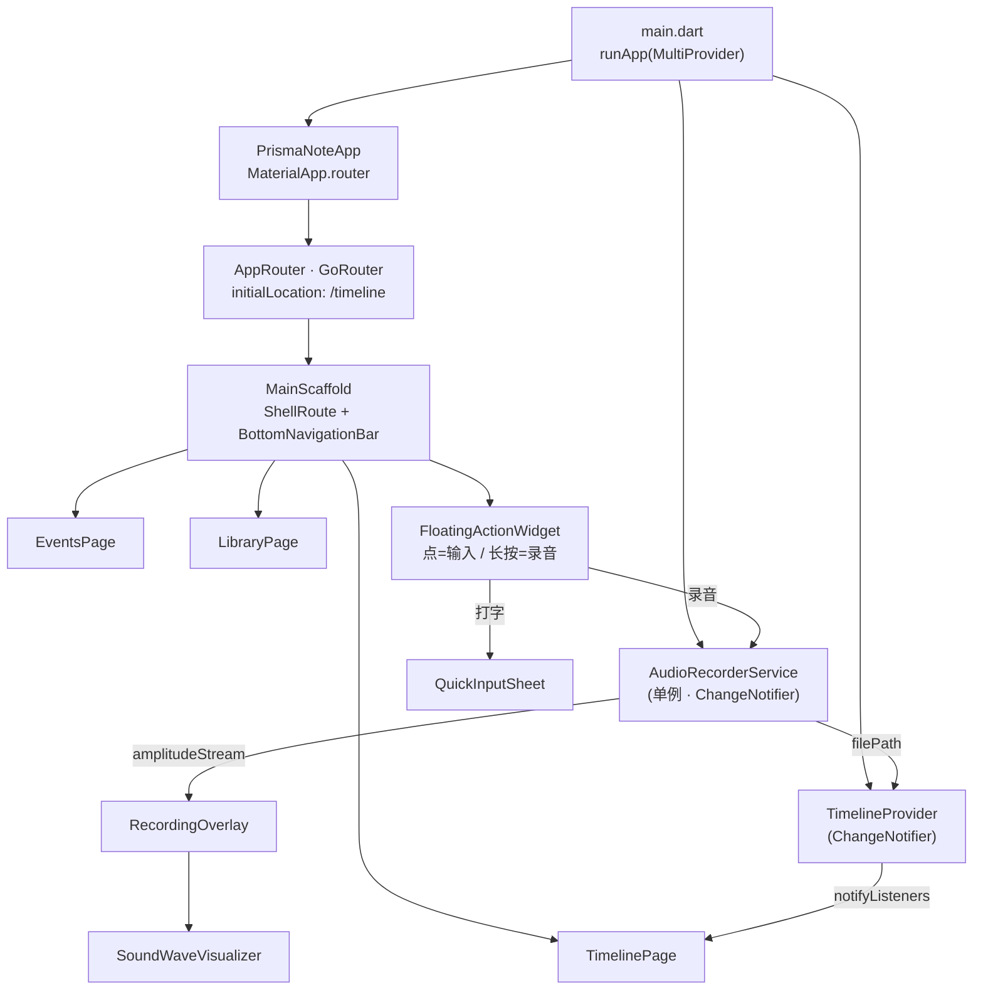
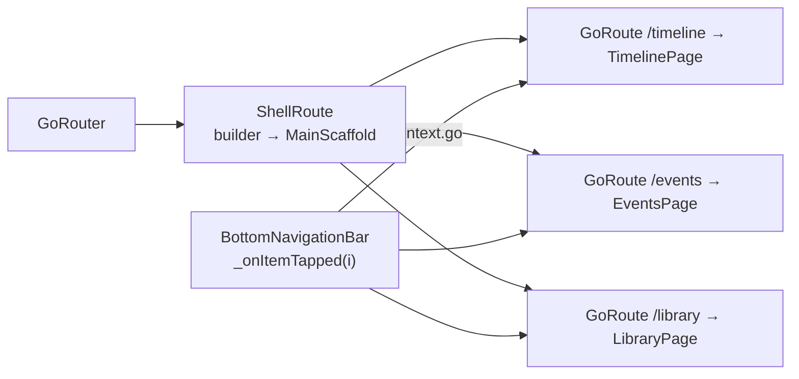
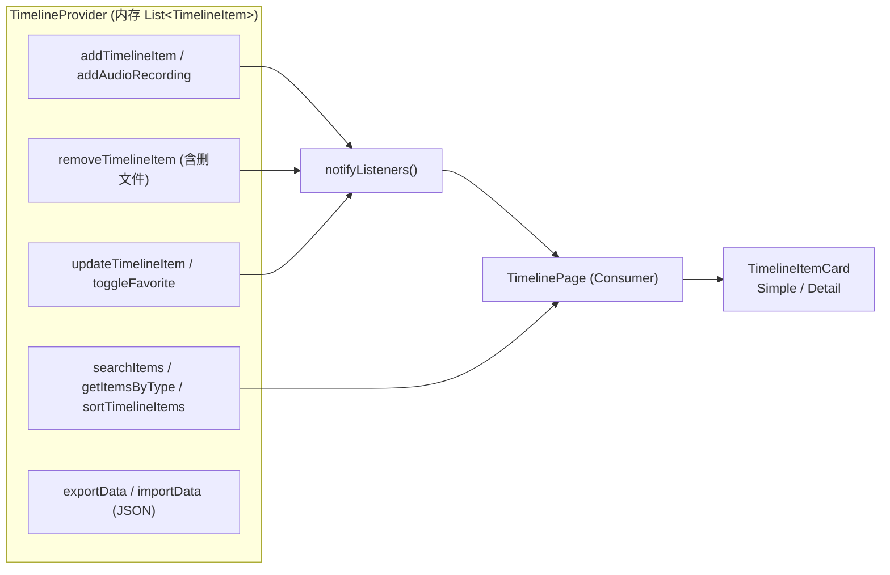
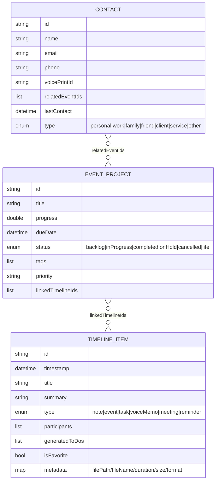
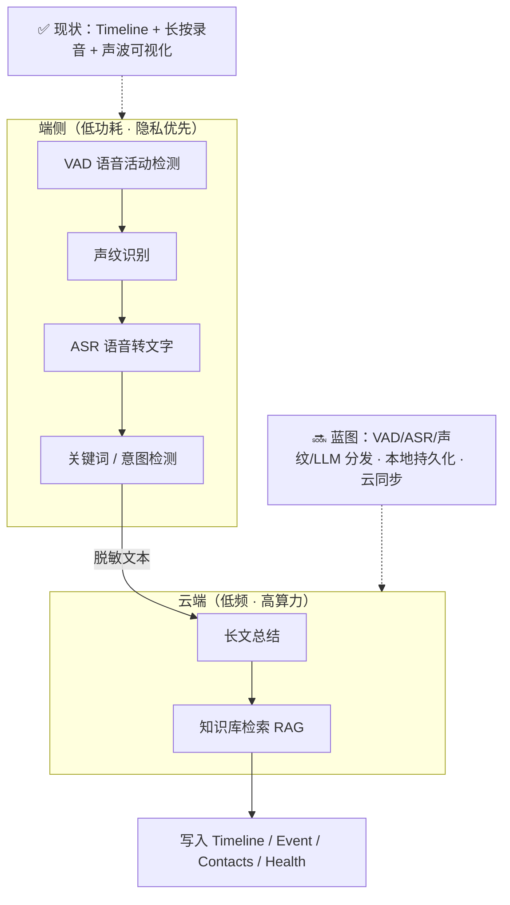

<div align="center">

> [English](./README_en.md) | **简体中文**


# Prisma Note · 棱镜记录

**长按悬浮球就能说话，松手即入时间轴 —— 用一条时间流，装下笔记、任务、会议与语音备忘。**

把「随手记一笔」这件小事，折叠成「时间轴 / 事件项目 / 资料库」三段式，让 ADHD 友好地一次只看一个焦点。


</div>

---

## 它解决什么问题

零散的想法、临时任务、一段会议、一句"回头再说"，总是散落在便签、聊天记录和脑子里。Prisma Note 把它们收进**同一条按日期组织的 `Timeline`（时间流）**，并由一个常驻的**悬浮球**统一入口：

- **快速记录**：点一下悬浮球 → 打字；**长按**悬浮球 → 直接录音，松手即存。
- **三种视角**：`Timeline`（发生了什么）→ `Events`（在做什么项目）→ `Library`（资料存在哪）。
- **面向 ADHD 的降噪设计**：`Timeline` 的 `Simple` 视图只给标题列表，避免信息过载；`Events` 用卡片封装，一次只面对一个项目。

> **诚信说明**：当前仓库是**早期原型（MVP）**。`Events` 与 `Library` 页面使用**硬编码示例数据**，`Timeline` 数据仅存于内存、**尚未接入持久化**（`SQLite/Hive` 仍在计划中）。本 README 只描述仓库中真实存在的代码，并对未完成部分如实标注。

---

## ✨ 功能

- ⏱️ **时间轴（Timeline）**：按日期筛选 + 搜索 + `Simple`/`Detail` 双视图；项目类型涵盖 `note / event / task / voiceMemo / meeting / reminder`。
- 🎙️ **长按录音**：`record` 插件以 **AAC-LC / 128 kbps / 44.1 kHz** 录制，输出 `m4a` 落盘到应用文档目录 `recordings/`。
- 🌊 **声波可视化**：`SoundWaveVisualizer` 7 根动态声波条 + 红点状态灯，录音浮层展示。
- 🗂️ **事件与项目（Events）**：按 `In Progress / Backlog / Projects / Life` 四个 Tab 分栏，卡片含进度条、优先级圆点、状态胶囊、标签与 `Tasks/Schedules` 计数。
- 📚 **资料库（Library）**：`Tasks / Contacts / Memos / Health` 四大分区入口，联系人按 `Work / Family / Client …` 分类查看。
- 🧩 **可复用的数据模型**：`TimelineItem` / `EventProject` / `Contact` 均带 `toJson`/`fromJson` 与 `copyWith`，为后续持久化预留接口。
- 🎨 **统一设计系统**：Material 3 + Google Fonts `Inter`，全局 **12px** 圆角、纯黑主色、零阴影（`elevation: 0`）。

---

## 🚀 快速开始

### 方式一：面向 AI Agent（一键安装，推荐）

把下面这段提示词直接发给你的本地 AI Agent（Claude Code / Codex / OpenCode …）：

````markdown
请帮我运行 Prisma Note（GitHub: https://github.com/RayMorTwinkle/prisma_note）。
背景：它是一个 Flutter 编写的效率应用原型，三段式「Timeline / Events / Library」+ 长按悬浮球录音备忘。

步骤：
1. 克隆：git clone https://github.com/RayMorTwinkle/prisma_note.git && cd prisma_note
2. 确认环境：flutter --version（需 Flutter 3.x，Dart SDK ^3.9.2）
3. 装依赖：flutter pub get
4. 静态检查：flutter analyze
5. 跑测试：flutter test（应通过 test/widget_test.dart）
6. 运行：flutter run（桌面端最省事，可直接 flutter run -d macos）
7. 向我说明：长按右下角悬浮球可录音，点击可打字；Events/Library 目前是示例数据。
````

### 方式二：面向人类用户

```bash
git clone https://github.com/RayMorTwinkle/prisma_note.git
cd prisma_note
flutter pub get
flutter run            # 或指定设备：flutter run -d macos / -d chrome / -d android
```

> **环境要求**：Flutter 3.x（`.metadata` 基于 stable 渠道）、Dart SDK `^3.9.2`。
> 录音功能需要麦克风权限：**Android 已声明** `RECORD_AUDIO`；**iOS / macOS 需自行补充**权限声明（见「注意事项」）。

---

## 🖥️ 使用

### 三条主路径

| 路径 | 页面 | 你能做什么 |
|---|---|---|
| `/timeline` | Timeline 时间轴 | 选日期（`±365` 天）→ 查看当天条目；搜索；`Simple`/`Detail` 切换 |
| `/events` | Events 事件与项目 | 按状态 Tab 浏览项目卡片与进度 |
| `/library` | Library 资料库 | 进入 Tasks / Contacts / Memos / Health 分区 |

### 悬浮球（`FloatingActionWidget`）两种手势

```text
        ┌─────────────┐
 点击 → │   键入笔记   │  QuickInputSheet：输入文本 → Add
        └─────────────┘
        ┌─────────────┐
 长按 → │  开始录音    │  RecordingOverlay：显示声波 + 红点，点击/取消结束
        └─────────────┘
```

### 常用命令

```bash
flutter pub get        # 安装依赖
flutter analyze        # 静态分析（flutter_lints）
flutter test           # 运行组件测试
flutter run -d macos   # 桌面端运行（开发调试首选）
```

---

## 🏗️ 架构

### 系统总览

`main.dart` 用 `MultiProvider` 注入两个全局 `ChangeNotifier`，再由 `AppRouter`（`GoRouter`）驱动 `MainScaffold`。



### 路由与导航

单层 `ShellRoute` 包住三个页面，底部导航通过 `context.go(...)` 切换，`MainScaffold` 的 `_currentIndex` 独立维护高亮。



### 录音流程（时序）

`AudioRecorderService.startRecording()` 是唯一真正调用麦克风的地方；注意振幅数据是**模拟生成**的（见技术细节）。

```mermaid
sequenceDiagram
  autonumber
  participant U as 用户
  participant F as FloatingActionWidget
  participant S as AudioRecorderService
  participant R as record 插件
  participant P as TimelineProvider

  U->>F: 长按悬浮球
  F->>S: requestMicrophonePermission()<br/>Permission.microphone.request()
  alt 已授权
    F->>S: startRecording()
    S->>S: 建目录 &lt;docs&gt;/recordings/
    S->>R: start(RecordConfig(aacLc, 128000, 44100), path)
    S->>S: _startAmplitudeSimulation()<br/>Timer 100ms → Random()*0.8
    S-->>F: amplitudeStream (broadcast)
    F->>U: showDialog(RecordingOverlay)
    U->>F: 点击结束
    F->>S: stopRecording()
    S->>R: stop()
    S-->>F: filePath = .../audio_note_&lt;ms&gt;.m4a
    F->>P: addAudioRecording(filePath)
    P->>P: insert(0, voiceMemo) + notifyListeners()
  else 未授权
    F->>U: SnackBar「Microphone permission required」
  end
```

### 状态管理数据流

`TimelineProvider` 是纯内存列表 + 一组增删改查；页面通过 `Consumer<TimelineProvider>` 响应刷新。



### 数据模型

三个模型彼此通过 **ID 列表**弱关联（`linkedTimelineIds` / `relatedEventIds`），并非数据库外键。



### 愿景架构（灵感来源于仓库设计文档）

`111超强灵感.md` 描绘了「端侧漏斗」的长期蓝图：端上做 VAD → 声纹 → ASR → 关键词，云端做总结与 RAG。**当前代码只实现了其中最基础的一环 —— 录音与时间轴**，其余为设计蓝图（待实现）。



---

## 📂 目录结构

```text
prisma_note/
├── lib/
│   ├── main.dart                      # 入口：MultiProvider + MaterialApp.router
│   ├── routing/app_router.dart        # GoRouter：ShellRoute + 三条路由
│   ├── pages/
│   │   ├── timeline_page.dart         # 时间轴（日期筛选 / 搜索 / Simple-Detail）
│   │   ├── events_page.dart           # 事件项目（4 Tab · 示例数据 _sampleProjects）
│   │   └── library_page.dart          # 资料库（Tasks/Contacts/Memos/Health）
│   ├── providers/timeline_provider.dart   # 内存状态：增删改查 / 搜索 / 导入导出
│   ├── services/audio_recorder_service.dart # 录音单例：权限 / 录制 / 模拟振幅流
│   ├── models/
│   │   ├── timeline_item.dart         # TimelineItem + TimelineType
│   │   ├── event_project.dart         # EventProject + ProjectStatus
│   │   └── contact.dart               # Contact + ContactType
│   ├── widgets/
│   │   ├── main_scaffold.dart         # 底部导航 + 悬浮球 宿主
│   │   ├── floating_action_widget.dart# 点=输入 / 长按=录音
│   │   ├── recording_overlay.dart     # 录音浮层（脉冲 + 声波）
│   │   ├── sound_wave_visualizer.dart # 7 段声波条组件
│   │   ├── project_card.dart / project_grid.dart
│   │   ├── cards/timeline_item_card.dart
│   │   └── sheets/                    # quick_input / search / contacts / tasks_year
│   ├── constants/                     # app_colors.dart / app_text_styles.dart
│   ├── theme/app_theme.dart           # Material 3 + Inter 主题
│   └── utils/date_utils.dart          # 相对时间 / 日期格式化
├── test/widget_test.dart              # 校验底部导航存在且为 3 项
├── assets/logo.svg                    # 本仓库 README 图标
├── android|ios|macos|web|windows|linux/ # 六端原生工程
├── 111超强灵感.md                      # 产品愿景设计文档
└── 未来-项目架构.md                    # 架构分析文档
```

---

## 🔧 技术细节

**录音参数（`audio_recorder_service.dart`）**

| 项 | 值 |
|---|---|
| 编码器 | `AudioEncoder.aacLc`（AAC-LC） |
| 码率 / 采样率 | `bitRate: 128000`、`sampleRate: 44100` |
| 输出 | `audio_note_<millisecondsSinceEpoch>.m4a` |
| 路径 | `${getApplicationDocumentsDirectory()}/recordings/`（自动创建） |
| 权限 | `permission_handler` 的 `Permission.microphone.request()` |

**声波是"模拟"的，不是真实电平。** 这是本仓库一个**必须点明的实现细节**：`_startAmplitudeSimulation()` 用 `Timer.periodic(Duration(milliseconds: 100))` 每 100ms 生成一个 `Random().nextDouble() * 0.8`，推送到 `StreamController<double>.broadcast()`。`record` 插件的真实振幅 API 未被使用。`SoundWaveVisualizer` 收到后按 `(amplitude * 10).clamp(0.0, 1.0)` 映射，再乘 7 根基准高度 `[0.3, 0.7, 0.4, 0.9, 0.2, 0.8, 0.5]`。

**TimelineItem.metadata 的真实键**：录音条目写入 `filePath` / `fileName` / `duration` / `size` / `format`。其中 `duration` 目前恒为占位符 `'00:00'`（源码注释标明"占位"），`size` 来自 `File.lengthSync()`。

**时间显示（`date_utils.dart`）**：`formatRelativeTime` 输出 `Xm ago / Xh ago / Xd ago`；`formatDate` 输出 `Overdue / Today / Tomorrow / Nd / d/m`。

**状态与主题**：`TimelineProvider` 列表 `insert(0, item)` 表示**最新在前**；`AppTheme.lightTheme` 用 `ColorScheme.fromSeed(seedColor: Colors.black)`，卡片圆角 12、`elevation: 0`，**仅浅色主题**。

**响应式项目网格**：`ProjectGrid` 在 `constraints.maxWidth > 600` 时用 3 列（`childAspectRatio 0.8`），否则 2 列（`0.75`）。

**测试**：`test/widget_test.dart` 断言 `BottomNavigationBar` 存在、`items.length == 3`、页面含 `Timeline` 文本。

**依赖（`pubspec.yaml` 声明 / `pubspec.lock` 解析）**：`go_router 17.0.1`、`provider 6.1.5+1`、`record 6.1.2`、`permission_handler 12.0.1`、`google_fonts 6.3.3`、`path_provider 2.1.5`、`uuid 4.5.2`、`intl 0.20.2`。

> ⚠️ `未来-项目架构.md` 中列出的版本（`go_router ^14`、`record ^5`、`permission_handler ^11`）**已过期**，请以 `pubspec.yaml` 为准。

---

## ❓ 常见问题

**Q：我的记录关掉 App 会丢吗？**
A：会。`TimelineProvider` 目前是纯内存 `List`，**没有接持久化层**。`exportData()/importData()` 已就绪但尚无 UI 调用（待确认后续计划）。

**Q：为什么声波看起来在动，我却没说话？**
A：因为它由 `Random()` 模拟生成，并非麦克风实时电平。见「技术细节」。

**Q：Events 里的项目、Library 里的联系人是真的吗？**
A：不是。它们分别来自 `events_page.dart` 的 `_sampleProjects` 与 `library_page.dart` 的 `_sampleContacts` 硬编码示例。

**Q：在 iOS / macOS 上录音没反应？**
A：iOS 的 `Info.plist` 缺 `NSMicrophoneUsageDescription`，macOS 的 `.entitlements` 缺 `com.apple.security.device.audio-input`。需按「注意事项」补充后才能录音。

---

## ⚠️ 注意事项

- **iOS 权限缺口**：`ios/Runner/Info.plist` 未声明 `NSMicrophoneUsageDescription`，录音前需补上，否则请求会失败。
- **macOS 权限缺口**：`macos/Runner/DebugProfile.entitlements` 与 `Release.entitlements` 均未包含麦克风 entitlement（`com.apple.security.device.audio-input`）。
- **Android 权限**：已声明 `RECORD_AUDIO`，并额外申请了 `READ/WRITE_EXTERNAL_STORAGE` 与 `MANAGE_EXTERNAL_STORAGE`（`tools:ignore="ScopedStorage"`），上架前请评估其必要性。
- **数据不持久化**：重启即清空，请勿用于存放重要数据。
- **功能占位**：Library 的 Month/Day View、Memos、Health 等入口点击后是 `SnackBar`「coming soon」；`TaskYearViewSheet` 中的图表为占位占位块。
- **`AudioRecorderService` 是单例**：`factory` 始终返回同一 `_instance`，通过 `ChangeNotifierProvider` 注入。

---

## 📄 License

本仓库当前**未附带 `LICENSE` 文件**（仓库根目录不存在该文件）。此前 README 曾声称 MIT，但仓库中并无对应许可文本，因此**默认保留所有权利**。若计划对外分发，建议补充一个明确的许可证（如 MIT）。

---

## 🙏 致谢 / Credits

- **产品与架构灵感**来自本仓库内的两份设计文档：`111超强灵感.md`（全域录音 / 端侧 AI 漏斗设想）与 `未来-项目架构.md`（分层架构分析）。
- 基于 **Flutter** 与 **Material 3** 构建；字体使用 Google Fonts 的 **Inter**。
- 依赖的开源库：`go_router`、`provider`、`record`、`permission_handler`、`path_provider`、`uuid`、`intl`。
- 本仓库的 `assets/logo.svg`、中英双语 README 与全部 Mermaid 图为本项目重制。

---

<div align="center">
<sub>Prisma Note · 让每一段被说过的话，都落在时间里</sub>
</div>
