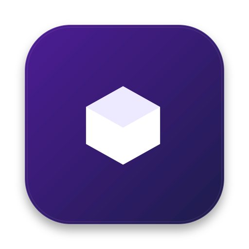
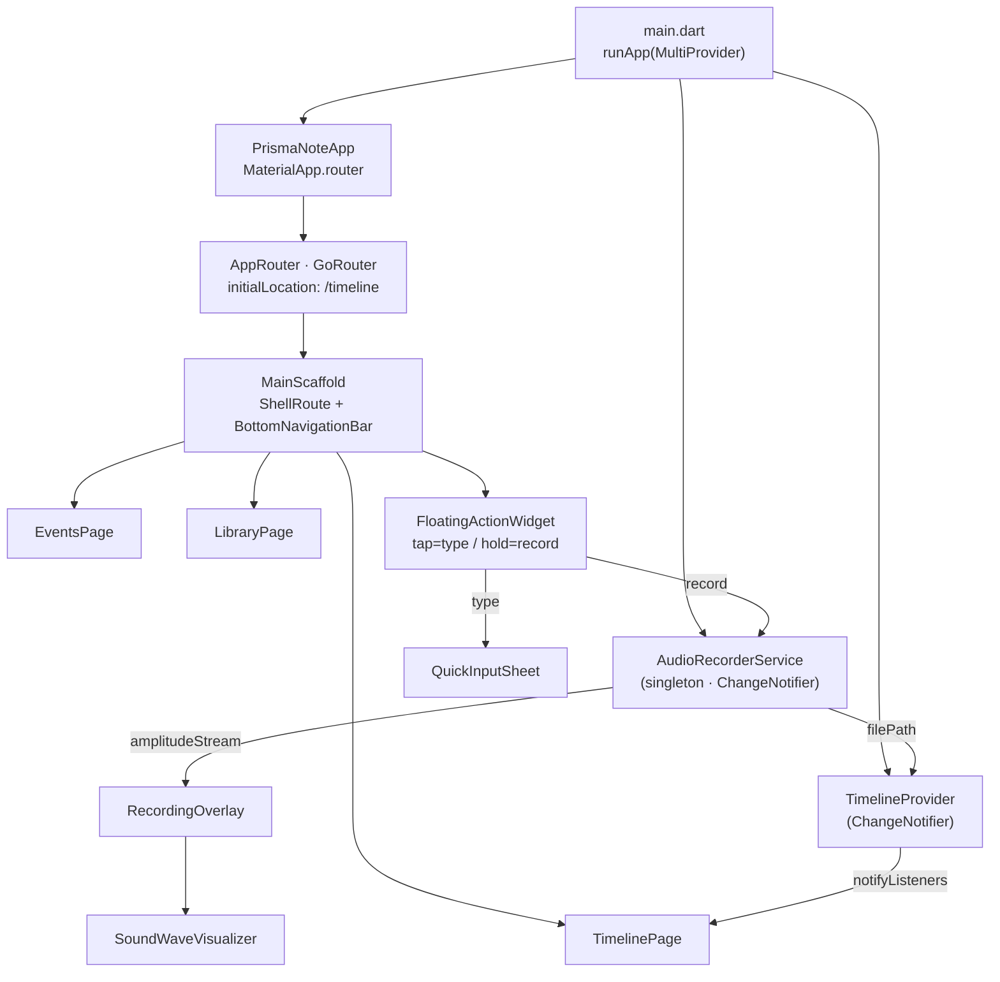
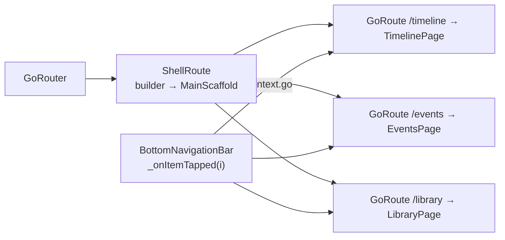
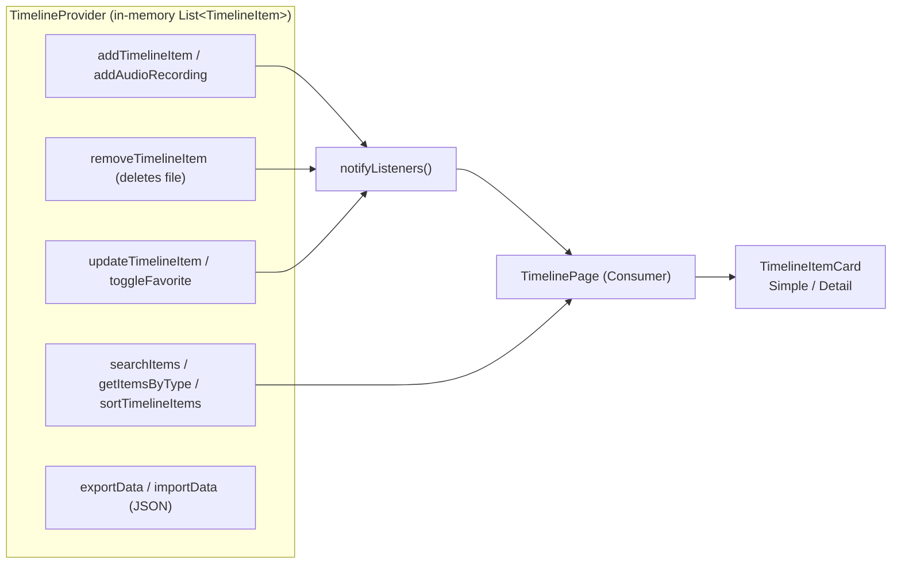
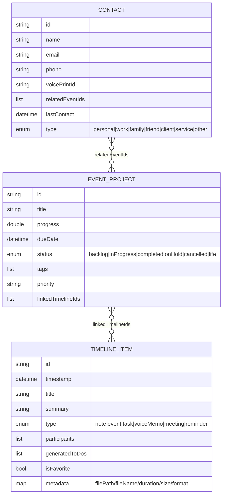
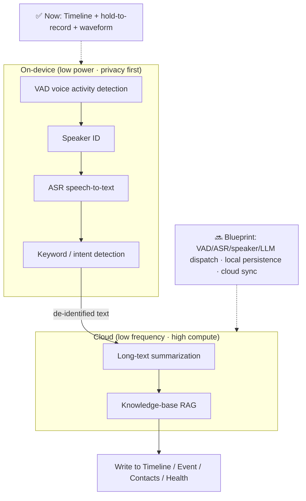

<div align="center">

> **English** | [简体中文](./README.md)



# Prisma Note · Prism Records

**Press and hold the orb to talk, release and it lands on the timeline — one stream holds your notes, tasks, meetings and voice memos.**

It folds the tiny act of "jotting something down" into a three-part shape — `Timeline / Events / Library` — so an ADHD-friendly mind faces one focus at a time.


</div>

---

## Why it exists

Stray ideas, ad-hoc tasks, a meeting, a "remind me later" — these scatter across sticky notes, chat logs and your head. Prisma Note collects them into **one date-organized `Timeline`**, behind a single always-present **floating orb**:

- **Capture fast**: tap the orb → type; **long-press** the orb → record directly, release to save.
- **Three lenses**: `Timeline` (what happened) → `Events` (what you're building) → `Library` (where data lives).
- **ADHD-friendly denoising**: the `Simple` view of `Timeline` shows only a title list to avoid overload; `Events` wraps each project in a card so you face one at a time.

> **Honesty note**: this repo is an **early prototype (MVP)**. The `Events` and `Library` pages use **hard-coded sample data**, and `Timeline` data lives **in memory only — no persistence yet** (`SQLite/Hive` is still planned). This README describes only code that actually exists in the repo, and labels unfinished parts plainly.

---

## ✨ Features

- ⏱️ **Timeline**: filter by date + search + `Simple`/`Detail` views; item types cover `note / event / task / voiceMemo / meeting / reminder`.
- 🎙️ **Long-press recording**: the `record` plugin captures **AAC-LC / 128 kbps / 44.1 kHz** and writes `m4a` files to the app documents `recordings/` folder.
- 🌊 **Waveform visualization**: `SoundWaveVisualizer` renders 7 animated bars plus a red status dot inside the recording overlay.
- 🗂️ **Events & Projects**: four tabs — `In Progress / Backlog / Projects / Life` — with cards showing a progress bar, priority dot, status chip, tags and `Tasks/Schedules` counts.
- 📚 **Library**: entries for `Tasks / Contacts / Memos / Health`, with contacts browsable by `Work / Family / Client …`.
- 🧩 **Reusable models**: `TimelineItem` / `EventProject` / `Contact` all ship `toJson`/`fromJson` and `copyWith`, leaving hooks for future persistence.
- 🎨 **One design system**: Material 3 + Google Fonts `Inter`, global **12px** radius, pure-black primary, zero shadows (`elevation: 0`).

---

## 🚀 Quick Start

### Option 1: For AI Agents (one-shot install, recommended)

Paste the prompt below into your local AI Agent (Claude Code / Codex / OpenCode …):

````markdown
Please run Prisma Note (GitHub: https://github.com/RayMorTwinkle/prisma_note).
Context: a Flutter productivity-app prototype with three parts "Timeline / Events / Library" plus long-press-to-record voice memos.

Steps:
1. Clone: git clone https://github.com/RayMorTwinkle/prisma_note.git && cd prisma_note
2. Check env: flutter --version (needs Flutter 3.x, Dart SDK ^3.9.2)
3. Install deps: flutter pub get
4. Static analysis: flutter analyze
5. Tests: flutter test (test/widget_test.dart should pass)
6. Run: flutter run (desktop is easiest, e.g. flutter run -d macos)
7. Tell me: long-press the bottom-right orb to record, tap to type; Events/Library are sample data for now.
````

### Option 2: For humans

```bash
git clone https://github.com/RayMorTwinkle/prisma_note.git
cd prisma_note
flutter pub get
flutter run            # or: flutter run -d macos / -d chrome / -d android
```

> **Requirements**: Flutter 3.x (`.metadata` targets the stable channel), Dart SDK `^3.9.2`.
> Recording needs microphone permission: **Android declares** `RECORD_AUDIO`; **iOS / macOS must be patched** (see Notes).

---

## 🖥️ Usage

### The three main paths

| Path | Page | What you can do |
|---|---|---|
| `/timeline` | Timeline | Pick a date (`±365` days) → see that day's items; search; toggle `Simple`/`Detail` |
| `/events` | Events & Projects | Browse project cards and progress by status tab |
| `/library` | Library | Enter the Tasks / Contacts / Memos / Health sections |

### The orb (`FloatingActionWidget`) — two gestures

```text
        ┌─────────────┐
  tap  →│  type note  │  QuickInputSheet: type text → Add
        └─────────────┘
        ┌─────────────┐
  hold →│ start rec.  │  RecordingOverlay: waveform + red dot; tap/cancel to stop
        └─────────────┘
```

### Common commands

```bash
flutter pub get        # install dependencies
flutter analyze        # static analysis (flutter_lints)
flutter test           # run widget tests
flutter run -d macos   # run on desktop (best for dev)
```

---

## 🏗️ Architecture

### System overview

`main.dart` injects two global `ChangeNotifier`s via `MultiProvider`; `AppRouter` (`GoRouter`) then drives `MainScaffold`.



### Routing & navigation

A single `ShellRoute` wraps the three pages; the bottom bar switches via `context.go(...)`, while `MainScaffold._currentIndex` tracks the highlight independently.



### Recording flow (sequence)

`AudioRecorderService.startRecording()` is the only place that truly touches the microphone; note that the amplitude data is **simulated** (see Technical notes).

```mermaid
sequenceDiagram
  autonumber
  participant U as User
  participant F as FloatingActionWidget
  participant S as AudioRecorderService
  participant R as record plugin
  participant P as TimelineProvider

  U->>F: long-press the orb
  F->>S: requestMicrophonePermission()<br/>Permission.microphone.request()
  alt granted
    F->>S: startRecording()
    S->>S: create dir &lt;docs&gt;/recordings/
    S->>R: start(RecordConfig(aacLc, 128000, 44100), path)
    S->>S: _startAmplitudeSimulation()<br/>Timer 100ms → Random()*0.8
    S-->>F: amplitudeStream (broadcast)
    F->>U: showDialog(RecordingOverlay)
    U->>F: tap to stop
    F->>S: stopRecording()
    S->>R: stop()
    S-->>F: filePath = .../audio_note_&lt;ms&gt;.m4a
    F->>P: addAudioRecording(filePath)
    P->>P: insert(0, voiceMemo) + notifyListeners()
  else denied
    F->>U: SnackBar "Microphone permission required"
  end
```

### State-management data flow

`TimelineProvider` is a plain in-memory list plus CRUD; pages refresh through `Consumer<TimelineProvider>`.



### Data models

The three models relate to each other through **ID lists** (`linkedTimelineIds` / `relatedEventIds`), not database foreign keys.



### Vision architecture (from the repo's design docs)

`111超强灵感.md` sketches a long-term on-device funnel: VAD → speaker ID → ASR → keywords on the device, summarization & RAG in the cloud. **The current code implements only the most basic link — recording and the timeline**; the rest is a blueprint (to be built).



---

## 📂 Project layout

```text
prisma_note/
├── lib/
│   ├── main.dart                      # entry: MultiProvider + MaterialApp.router
│   ├── routing/app_router.dart        # GoRouter: ShellRoute + three routes
│   ├── pages/
│   │   ├── timeline_page.dart         # timeline (date filter / search / Simple-Detail)
│   │   ├── events_page.dart           # events (4 tabs · sample data _sampleProjects)
│   │   └── library_page.dart          # library (Tasks/Contacts/Memos/Health)
│   ├── providers/timeline_provider.dart    # in-memory state: CRUD / search / import-export
│   ├── services/audio_recorder_service.dart# recording singleton: permission / record / fake amplitude
│   ├── models/
│   │   ├── timeline_item.dart         # TimelineItem + TimelineType
│   │   ├── event_project.dart         # EventProject + ProjectStatus
│   │   └── contact.dart               # Contact + ContactType
│   ├── widgets/
│   │   ├── main_scaffold.dart         # bottom nav + orb host
│   │   ├── floating_action_widget.dart# tap=type / hold=record
│   │   ├── recording_overlay.dart     # recording overlay (pulse + wave)
│   │   ├── sound_wave_visualizer.dart # 7-bar visualizer
│   │   ├── project_card.dart / project_grid.dart
│   │   ├── cards/timeline_item_card.dart
│   │   └── sheets/                    # quick_input / search / contacts / tasks_year
│   ├── constants/                     # app_colors.dart / app_text_styles.dart
│   ├── theme/app_theme.dart           # Material 3 + Inter theme
│   └── utils/date_utils.dart          # relative time / date formatting
├── test/widget_test.dart              # asserts bottom nav exists with 3 items
├── assets/logo.svg                    # icon used by this README
├── android|ios|macos|web|windows|linux/ # six native platform projects
├── 111超强灵感.md                      # product-vision design doc (Chinese)
└── 未来-项目架构.md                    # architecture-analysis doc (Chinese)
```

---

## 🔧 Technical notes

**Recording parameters (`audio_recorder_service.dart`)**

| Item | Value |
|---|---|
| Encoder | `AudioEncoder.aacLc` (AAC-LC) |
| Bitrate / sample rate | `bitRate: 128000`, `sampleRate: 44100` |
| Output | `audio_note_<millisecondsSinceEpoch>.m4a` |
| Path | `${getApplicationDocumentsDirectory()}/recordings/` (auto-created) |
| Permission | `permission_handler` → `Permission.microphone.request()` |

**The waveform is *simulated*, not real level.** This is an implementation detail that **must be called out**: `_startAmplitudeSimulation()` uses `Timer.periodic(Duration(milliseconds: 100))` to push a `Random().nextDouble() * 0.8` every 100ms into a `StreamController<double>.broadcast()`. The `record` plugin's real amplitude API is not used. `SoundWaveVisualizer` maps it via `(amplitude * 10).clamp(0.0, 1.0)` and multiplies by the 7 base heights `[0.3, 0.7, 0.4, 0.9, 0.2, 0.8, 0.5]`.

**Real keys inside `TimelineItem.metadata`**: a voice item writes `filePath` / `fileName` / `duration` / `size` / `format`. `duration` is currently a placeholder `'00:00'` (the source comments say so), and `size` comes from `File.lengthSync()`.

**Time display (`date_utils.dart`)**: `formatRelativeTime` returns `Xm ago / Xh ago / Xd ago`; `formatDate` returns `Overdue / Today / Tomorrow / Nd / d/m`.

**State & theme**: `TimelineProvider` uses `insert(0, item)` so **newest first**; `AppTheme.lightTheme` uses `ColorScheme.fromSeed(seedColor: Colors.black)`, 12px card radius, `elevation: 0`, **light theme only**.

**Responsive project grid**: `ProjectGrid` uses 3 columns (`childAspectRatio 0.8`) when `constraints.maxWidth > 600`, otherwise 2 (`0.75`).

**Test**: `test/widget_test.dart` asserts a `BottomNavigationBar` exists, `items.length == 3`, and the page contains `Timeline` text.

**Dependencies (declared in `pubspec.yaml` / resolved in `pubspec.lock`)**: `go_router 17.0.1`, `provider 6.1.5+1`, `record 6.1.2`, `permission_handler 12.0.1`, `google_fonts 6.3.3`, `path_provider 2.1.5`, `uuid 4.5.2`, `intl 0.20.2`.

> ⚠️ Versions listed in `未来-项目架构.md` (`go_router ^14`, `record ^5`, `permission_handler ^11`) are **outdated**; trust `pubspec.yaml`.

---

## ❓ FAQ

**Q: Will my records survive closing the app?**
A: No. `TimelineProvider` is a plain in-memory `List` with **no persistence layer**. `exportData()/importData()` exist but no UI calls them yet (to be confirmed).

**Q: Why does the waveform move when I'm not speaking?**
A: Because it is generated by `Random()`, not real mic level. See Technical notes.

**Q: Are the projects in Events / contacts in Library real?**
A: No. They come from the hard-coded `_sampleProjects` in `events_page.dart` and `_sampleContacts` in `library_page.dart`.

**Q: Recording does nothing on iOS / macOS?**
A: The iOS `Info.plist` is missing `NSMicrophoneUsageDescription`, and the macOS `.entitlements` are missing `com.apple.security.device.audio-input`. Add them (see Notes) before recording.

---

## ⚠️ Notes

- **iOS permission gap**: `ios/Runner/Info.plist` does not declare `NSMicrophoneUsageDescription`; the request will fail without it.
- **macOS permission gap**: neither `macos/Runner/DebugProfile.entitlements` nor `Release.entitlements` includes the microphone entitlement (`com.apple.security.device.audio-input`).
- **Android permissions**: `RECORD_AUDIO` is declared, plus `READ/WRITE_EXTERNAL_STORAGE` and `MANAGE_EXTERNAL_STORAGE` (`tools:ignore="ScopedStorage"`) — review necessity before shipping.
- **No persistence**: data clears on restart; do not store anything important.
- **Placeholders**: Library's Month/Day View, Memos and Health show a `SnackBar` "coming soon"; the chart in `TasksYearViewSheet` is a placeholder block.
- **`AudioRecorderService` is a singleton**: its `factory` always returns the same `_instance`, injected via `ChangeNotifierProvider`.

---

## 📄 License

This repo currently ships **no `LICENSE` file** (none exists at the repo root). An earlier README claimed MIT, but no license text is present, so **all rights are reserved by default**. If you plan to distribute it, add an explicit license (e.g. MIT).

---

## 🙏 Credits

- **Product & architecture inspiration** comes from two design docs inside this repo: `111超强灵感.md` (all-day recording / on-device AI funnel) and `未来-项目架构.md` (layered architecture analysis).
- Built with **Flutter** and **Material 3**; typography via Google Fonts **Inter**.
- Open-source dependencies: `go_router`, `provider`, `record`, `permission_handler`, `path_provider`, `uuid`, `intl`.
- The `assets/logo.svg`, the bilingual READMEs and all Mermaid diagrams were produced for this project.

---

<div align="center">
<sub>Prisma Note · every spoken word lands in time</sub>
</div>
